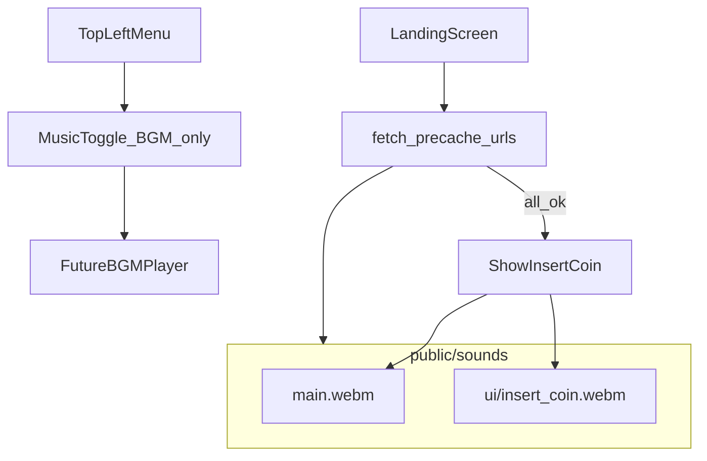

> **Workspace copy:** This is the same plan as in Cursor’s **Plans** panel: `C:\Users\kende\.cursor\plans\hiit_sound_profile_f08f8618.plan.md`. Your repo path: `hiitdaslots/HIIT_SOUND_PROFILE_PLAN.md`. Reconcile if they ever differ.

## Implementation checklist (todos)

- [ ] **mkdir-sounds** — `public/sounds/ui/insert_coin.webm`; optional `slots/`, `workout/`
- [ ] **write-profile-md** — `public/sounds/SOUND_PROFILE.md` (precache, `insert_coin`, Music = BGM only)
- [ ] **sound-manifest** — `src/audio/soundManifest.ts` with `PRECACHE_SOUND_URLS` (`/sounds/main.webm`, `/sounds/ui/insert_coin.webm`, …)
- [ ] **landing-precache-ux** — `LandingScreen`: parallel `fetch`, progress bar under title, hide CTA until all `ok`, retry on error
- [ ] **wire-main-webm** — INSERT COIN: parallel `Audio` for `main.webm` + `ui/insert_coin.webm`, then `onStart`
- [ ] **app-hamburger-menu** — fixed top-left, `Sheet` from left, high z-index
- [ ] **music-toggle-pref** — `localStorage` `hiitda-music-enabled`; **BGM only**, never gates SFX

# Sound profile and asset folder for HIIT Da Slots

## Context

> **Insert coin audio (explicit request):** When the user clicks **INSERT COIN TO PLAY**, the app must play **`/sounds/main.webm`** and, **in addition**, **`/sounds/ui/insert_coin.webm`**, in parallel in the same user gesture. Both URLs belong in **`PRECACHE_SOUND_URLS`**. The Music menu toggle (**BGM only**) does **not** affect these two clips.

The app lives under `[Z:\Misc\webpages\hiitdaslots](Z:\Misc\webpages\hiitdaslots)` (`[src/App.tsx](Z:\Misc\webpages\hiitdaslots\src\App.tsx)`): **landing → setup → slot reel → ready → workout runner**. There is **no audio implementation yet** in `[WorkoutRunner.tsx](Z:\Misc\webpages\hiitdaslots\src\components\WorkoutRunner.tsx)`, `[SlotReel.tsx](Z:\Misc\webpages\hiitdaslots\src\components\SlotReel.tsx)`, or related screens — **except** the **landing precache + CTA audio** described below (to be wired when the plan is executed). **Precache runs regardless of Music toggle** (BGM-only switch does not skip fetches).

**Your assets:** `public/sounds/main.webm` → `/sounds/main.webm`. **Also add** `public/sounds/ui/insert_coin.webm` → `/sounds/ui/insert_coin.webm` (played together with `main.webm` on INSERT COIN). Static files live under Vite `[public/](Z:\Misc\webpages\hiitdaslots\public)`; URLs are from site root (e.g. `/sounds/slots/reel-stop.webm`).

You also have a parallel tree at `[hiitdaslots/new/](Z:\Misc\webpages\hiitdaslots\new)` (workspace package). **Decide whether you ship from root or `new/**` and mirror the same `public/sounds/` layout in the tree you actually build, or only maintain one copy to avoid drift.

## Folder layout (drop zone)

**Present / required for landing:** `public/sounds/main.webm` and `public/sounds/ui/insert_coin.webm` (both fire on every INSERT COIN; **not** gated by Music).

**Optional extra structure** under the same root as you add more clips:

```text
public/sounds/
  main.webm           # landing — with insert_coin.webm; not gated by Music
  ui/
    insert_coin.webm  # landing INSERT COIN; not gated by Music
  music/              # optional future BGM — *only* this category uses the Music menu toggle
  slots/              # reel SFX — not gated by Music
  workout/            # workout SFX — not gated by Music
```

Add empty dirs with a tiny placeholder (e.g. `.gitkeep`) only if your tooling ignores empty folders.

**Recommended format:** `.webm` (Opus) and/or `.mp3` for broad browser support; keep clips short (SFX &lt; 2s, stingers &lt; 5s) and normalized loudness so levels feel consistent.

## Sound profile: events and suggested files

Map each clip to a **stable filename** the app can reference later.

### Landing (implemented first)

On **INSERT COIN TO PLAY** (`[LandingScreen.tsx](Z:\Misc\webpages\hiitdaslots\src\components\LandingScreen.tsx)`, button `onClick` → `onStart`, lines 60–66), always play **both** clips in parallel (same user gesture). **Music on/off does not affect these sounds.**


| ID                    | Role on landing                    | File (actual)                           | Public URL                     |
| --------------------- | ---------------------------------- | --------------------------------------- | ------------------------------ |
| `landing.insert_coin` | Primary sting                      | `public/sounds/main.webm`               | `/sounds/main.webm`            |
| `ui.insert_coin`      | Insert-coin SFX layered with main | `public/sounds/ui/insert_coin.webm`     | `/sounds/ui/insert_coin.webm`  |


Playback should start in the **same user gesture** as the click so autoplay policies allow sound. Navigation to setup (`onStart`) can proceed immediately; both clips run in parallel.

### Landing precache (required)

- **Goal:** Before the user can start, **warm the browser cache** for every shipped sound so first interactions feel instant.
- **Mechanism:** On `[LandingScreen.tsx](Z:\Misc\webpages\hiitdaslots\src\components\LandingScreen.tsx)` mount, **`fetch(url)`** each entry in **`PRECACHE_SOUND_URLS`** (from `soundManifest.ts`). No service worker required for v1; HTTP cache is enough. Optionally `cache: 'force-cache'` is unnecessary if responses are normal static assets with cache headers.
- **Progress UI:** A **stylized horizontal bar** placed **under the main title** (after the existing title + `landing-title-underline`, still above the tagline — see lines 30–40 in `LandingScreen.tsx`). Fill width reflects **`completedFetches / total`** (update as each request settles, not byte-weighted).
- **CTA gate:** The **INSERT COIN TO PLAY** control stays **hidden** (or `invisible` + `pointer-events-none` + not focusable) until **all** precache fetches return **`response.ok`**. Hamburger/menu can stay visible during load so settings remain reachable.
- **Failure:** If any URL 404s or network fails, **do not** reveal the CTA; show a short error under the bar and a **Retry** that re-runs the batch.
- **Expansion:** When new clips exist on disk, add their public paths to **`PRECACHE_SOUND_URLS`** so landing always prefetches the full set before play.

### App chrome: hamburger + Music toggle

- **Placement:** Fixed **top-left** (e.g. `top-4 left-4`, `z-index` above full-screen views such as `[WorkoutRunner](Z:\Misc\webpages\hiitdaslots\src\components\WorkoutRunner.tsx)` which uses a top progress bar — menu should remain reachable; use `z-50` or higher).
- **Behavior:** Tap hamburger → open sheet/drawer from the **left**; primary content is a **Music** labeled control.
- **Semantics (critical):** **Music** means **background music only.** When off: do not play / pause **BGM** (e.g. a future loop). When on: allow BGM. **All other sounds** — landing **`main.webm`** + **`ui/insert_coin.webm`**, future slots SFX, workout SFX, UI stings — **always follow their own triggers** and **ignore** this toggle. A separate **master/SFX** mute is not in scope unless added later.
- **Persistence:** Read/write `localStorage` on change; initialize from storage in `App` (or `MusicPreferenceProvider`) for **BGM** consumers only.

### Slots (`[SlotReel.tsx](Z:\Misc\webpages\hiitdaslots\src\components\SlotReel.tsx)`)


| ID                  | When it fires (UX)                                                                      | Suggested path                       | Notes                                                          |
| ------------------- | --------------------------------------------------------------------------------------- | ------------------------------------ | -------------------------------------------------------------- |
| `slots.spin_loop`   | While all three reels are in `spinning`                                                 | `public/sounds/slots/spin-loop.webm` | Optional short seamless loop or mechanical tick; mute-friendly |
| `slots.reel_settle` | Each reel enters `settling` then `settled` (3×, staggered ~1.1s / 1.65s / 2.2s + 500ms) | `public/sounds/slots/reel-stop.webm` | Same one-shot three times, or three variants `reel-stop-1/2/3` |
| `slots.jackpot`     | When `jackpot` becomes true (~2.78s after mount)                                        | `public/sounds/slots/jackpot.webm`   | Short fanfare / coin burst                                     |


### Workout (`[WorkoutRunner.tsx](Z:\Misc\webpages\hiitdaslots\src\components\WorkoutRunner.tsx)`)


| ID                          | When it fires                                            | Suggested path                                                        | Notes                                                   |
| --------------------------- | -------------------------------------------------------- | --------------------------------------------------------------------- | ------------------------------------------------------- |
| `workout.phase_rest`        | Enter a **rest** item (timer starts)                     | `public/sounds/workout/rest-start.webm`                               | Calm / downbeat                                         |
| `workout.phase_exercise`    | Enter an **exercise** item                               | `public/sounds/workout/exercise-start.webm`                           | Upbeat punch                                            |
| `workout.timer_tick`        | Optional: each second while timer running                | Usually skip; use only if subtle                                      |                                                         |
| `workout.countdown_warning` | Last **5** seconds in time-attack (UI already turns red) | `public/sounds/workout/countdown-tick.webm`                           | Same one-shot played 5→1, or escalating pitch in assets |
| `workout.segment_end`       | Timer hits 0 (auto-advance) or user skips                | `public/sounds/workout/segment-complete.webm`                         | Short “ding”                                            |
| `workout.rep_done`          | User taps **DONE** (rep-quest mode)                      | Can reuse `segment-complete` or `public/sounds/workout/rep-done.webm` |                                                         |
| `workout.complete`          | Workout finished (trophy screen)                         | `public/sounds/workout/workout-complete.webm`                         | Victory sting                                           |


### UI (optional, cross-screen)


| ID            | When                                                                                    | Suggested path                  |
| ------------- | --------------------------------------------------------------------------------------- | ------------------------------- |
| `ui.navigate` | Primary CTA **other than** landing INSERT COIN (e.g. start workout, claim reward) later | `public/sounds/ui/confirm.webm` |
| `ui.insert_coin` | **Landing only** — with `main.webm` (see landing table)                              | `public/sounds/ui/insert_coin.webm` |
| `ui.back`     | Quit / secondary                                                                        | `public/sounds/ui/cancel.webm`  |


### Setup / ready (optional)

`[SetupForm](Z:\Misc\webpages\hiitdaslots\src\components\SetupForm.tsx)` and `[WorkoutReadyScreen](Z:\Misc\webpages\hiitdaslots\src\components\WorkoutReadyScreen.tsx)` have no special timing hooks today; if you add sounds later, reuse `ui.confirm` / `ui.cancel` or add `public/sounds/ui/toggle.webm` for form controls.

## Deliverable file(s)

1. **Human-readable profile** — e.g. `[public/sounds/SOUND_PROFILE.md](Z:\Misc\webpages\hiitdaslots\public\sounds\SOUND_PROFILE.md)` containing: the table above, format/loudness notes, explicit rule that **Music toggle = BGM only** (not SFX), `localStorage` key, and **“Drop files here; URLs are `/sounds/...`.”**
2. **Machine-readable manifest (required for implementation)** — `[src/audio/soundManifest.ts](Z:\Misc\webpages\hiitdaslots\src\audio\soundManifest.ts)`: export **`PRECACHE_SOUND_URLS`** and reuse the same paths for playback wiring; document in `SOUND_PROFILE.md` that new files must be added to this list.




## Out of scope (unless you ask)

- **Sound manifest**, **landing precache + progress bar + CTA gate**, **landing audio** (`main.webm` + `ui/insert_coin.webm`), **hamburger menu**, and **Music** toggle — in scope via todos `sound-manifest`, `landing-precache-ux`, `wire-main-webm`, `app-hamburger-menu`, and `music-toggle-pref` when you execute this plan.
- Playback for slots/workout/SFX (beyond the profile doc), **actual BGM file + player** (toggle UI is in scope; no loop asset yet), separate master/SFX mute, volume sliders, or preloading — would touch `WorkoutRunner`, `SlotReel`, and possibly a small `useSound` hook.
- Sourcing or licensing actual recordings.

